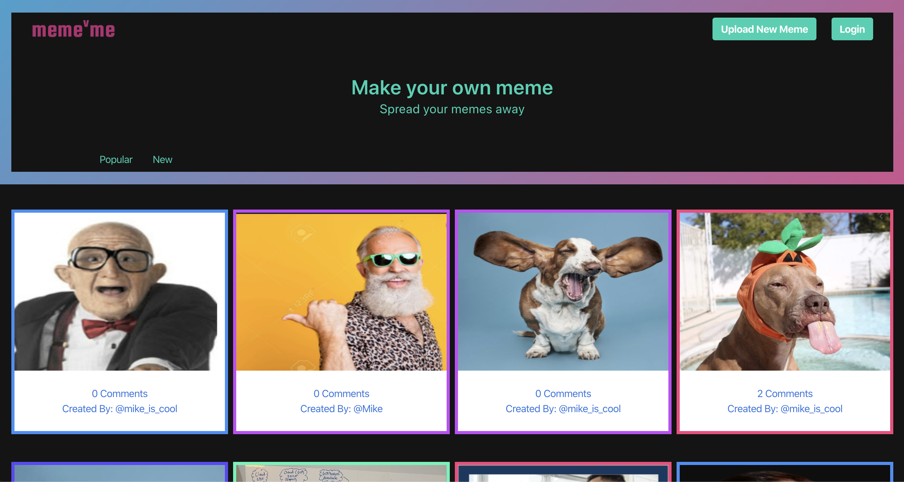
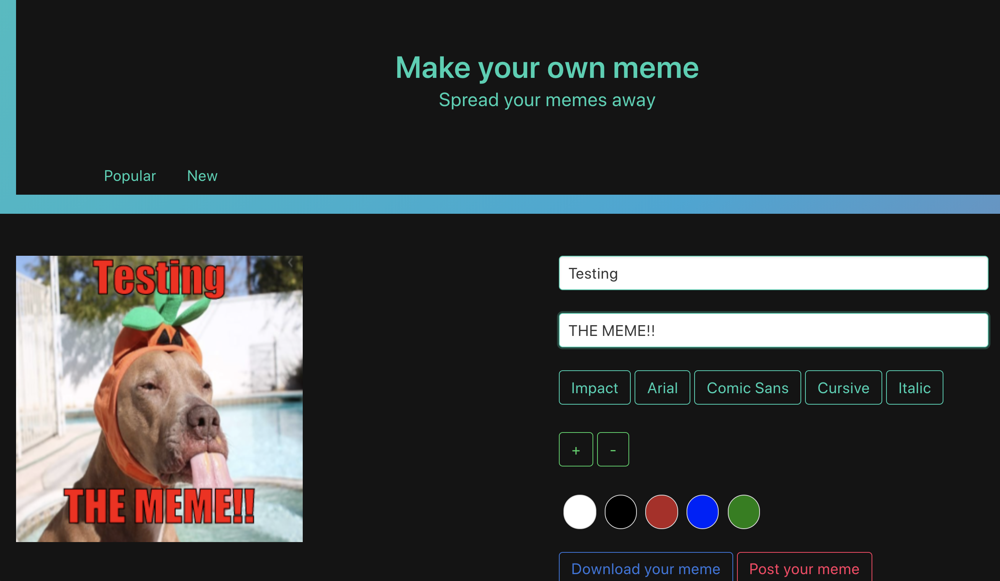

# meme-me

Meme-me is a social Memeing platform where users can upload pictures they think would make good memes. Other users can then submit Meme captions for these pictures and even download examples!

# Non-technical Overview

### Features:

1. Create your own user profile
2. Upload images to the Meme-me website
3. Edit and download your own memes with various fonts, sizes, placements and colors
4. Submit comments on other users memes
5. Vote on other users memes

### Samples:

<br/>

 <br/>

# Technical Overview

### Dependencies/Utilized Technologies:

- Node.js
- Express.js
- Passport.js (authentication)
- Auth0 (authentication server)
- Sequelize
- Handlebars

### Live App:

[Live Heroku App](https://meme-me-app.herokuapp.com/)

### Deploying locally🚀:

1. Clone this repository `git clone https://github.com/mpgelber7495/meme-me.git`
2. Run `npm install`
3. Create a `.env` file with the following variables:

```
AUTH0_CLIENT_ID="[YOUR_CLIENT_ID]"
AUTH0_DOMAIN="[YOUR_AUTH0_DOMAIN]"
AUTH0_CLIENT_SECRET="[YOUR_AUTH0_CLIENT_SECRET"
```

4. If you're using a local database, set that variable in ./config/index.js
5. Change the `PORT` variable in ./index.js if you'd like
6. Run `node index.js` and go to `localhost:8080/` in your browser

# Contributors

- [Mike Gelber](https://github.com/mpgelber7495/)
- [Moon Jo](https://github.com/moon-mnny)
- [Ed Hill](https://github.com/edwardphill)
